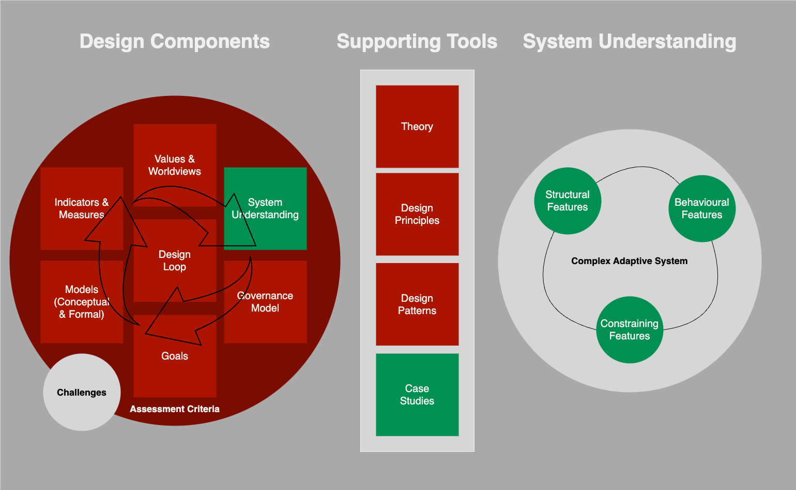

# Designing for Social-Ecological Systems

This is the first diagram I created when starting to learn about social-ecological systems research in 2022 and it hasn't changed much since its initial conceptualisation. It was my attempt to map and navigate the literature.

## System Understanding

Social-ecological systems research is broadly concerned with understanding interactions between human and nature and sees these interactions through the lens of complex adaptive systems (CAS, circle on the left). I categorise the features of CAS into constraining features (boundaries and context), structural features (components and interactions), and behavioural features (how components behave). 

The starting point is generally identifying primary interactions (aka: processes or action situations) and components (aka: agents or entities), the things which take part in processes.

## Design Components

Design components (circle on the left) are a series of linked social practices used to explore how to understand and typically live-with a social-ecological system without degrading or destroying it. The point of each component is to make its contents explicit, including its assessment criteria and associated challenges.

A secondary point is that these components affect each other.

## Supporting Tools

Support tools (stack in the middle) is a categorisation of the social-ecological systems research literature. Much research has centered on case studies and there is a need to establish design patterns, design principles, and theory in order to apply knowledge more widely. This is a challenge for CAS knowledge as context is important, as is how a CAS is defined.