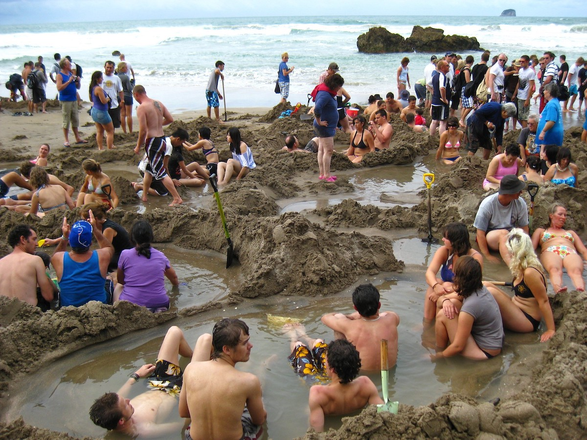

# Agent-Based Models

Image: CC BY-SA 2.0 by Flickr/Eli Duke

## Examples

- Complexity Explorables https://www.complexity-explorables.org/topics/agent-based-models
- Game of Thrones ABM https://claudinegravelmigu.wixsite.com/got-abm/overview

## Purpose

- The potential of models and modeling for social-ecological systems research: The reference frame ModSES https://ecologyandsociety.org/vol24/iss1/art31/

## Books

- Agent-Based Modeling for Archaeology: Simulating the Complexity of Societies https://www.sfipress.org/books/agent-based-modeling-archaeology

## Standards

- Towards better modelling and decision support: Documenting model development, testing, and analysis using TRACE https://doi.org/10.1016/j.ecolmodel.2014.01.018
- A standard protocol for describing individual-based and agent-based models” publication: Ecological Modelling https://doi.org/10.1016/j.ecolmodel.2006.04.023
- Describing human decisions in agent-based models–ODD+ D, an extension of the ODD protocol https://doi.org/10.1016/j.envsoft.2013.06.003

## Frameworks   

### General Purpose Languages

- https://mesa.readthedocs.io
- https://helipad.dev/
- https://cs.gmu.edu/~eclab/projects/mason/ 
- https://gama-platform.org/
- https://juliadynamics.github.io/Agents.jl/

### IDEs

- https://ccl.northwestern.edu/netlogo/
- http://netlogoweb.org/
- https://www.anylogic.com/use-of-simulation/agent-based-modeling/

## Repositories

- CoMSES Net https://www.comses.net/codebases
